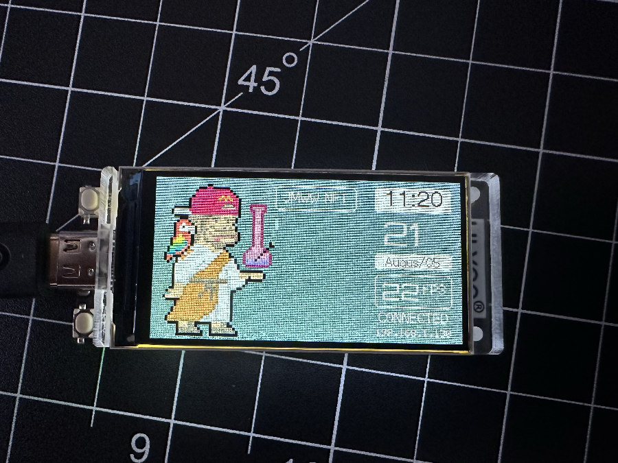

# Gif To Code Array for Aruduino




This will take an animated Gif and convert it to a const unsigned short Array. This can be used to display animated gifs on a Arduino or Lillygo LCD screen
# TO USE

Update the following in the code with YOUR info
`[YOUR_GIF_PATH_HERE]`
example: awesomeAnimation.gif

`[YOUR_WIDTH], [YOUR_HEIGHT]`
example: 320,170

`[YOUR_FILE_NAME_HERE]`
example: awesomeAnimationCode.h


- Make sure you have lastest version of python 3 installed
```js
//mac
brew install python
```
- Make sure you install pillow >=10
```js
pip install Pillow
```
- Make sure your have a working animated gif

Run it.
```js
python gif_to_array.py
```


